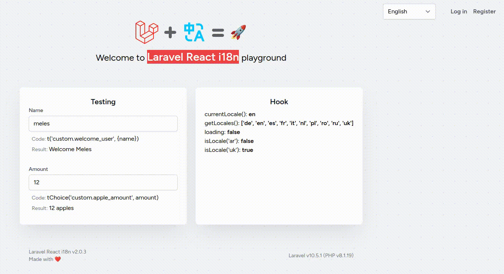

<h1 align="center" style="border:none !important">
    Laravel React i18n playground
</h1>

## Requirements 💻
- Docker (with docker-compose)
- Composer >= 2.x
- Npm >= 9.x

## Setup 🤔

#### Composer & Npm:
> in root dir of project:
1. `cd ./laravel/`
2. `chmod 757 -R ./storage`
3. `composer install && npm install`
4. `npm run build && npm run dev`

#### Docker:
>in root dir of project:
1. `docker-compose build`
2. `docker-compose up -d`
3. `make artisan make:migration create_flights_table`

## Done 🎉

### Visit http://localhost/ 